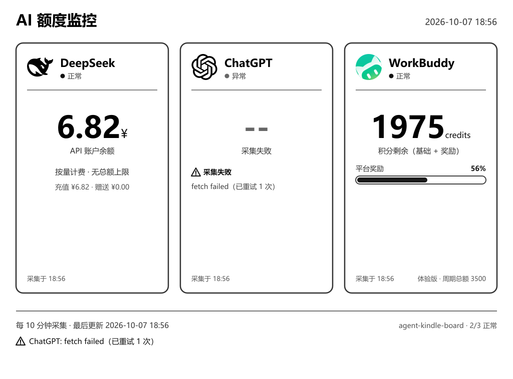

# agent-kindle-board

局域网 AI 额度监控板：NAS 每 10 分钟采集各平台剩余额度，渲染成灰度 PNG；一台闲置的 Kindle Paperwhite 1 横放，定时拉图直刷帧缓冲当墨水屏。



（示例图为 MOCK 数据渲染，`MOCK=1 npm run preview` 可重新生成）

三张卡片互相独立，一个平台失败只影响自己的卡片：

- DeepSeek：API 账户余额（¥），按量计费
- ChatGPT：Plus 订阅的 5 小时窗口与周额度，各一条进度条、各自倒计时
- WorkBuddy：套餐基础积分与平台奖励积分分开显示，大数字为合计剩余

## 快速开始

```bash
cp config.example.yaml config.yaml    # 填凭证，见下文
docker compose up -d                  # 有源码的机器可直接 --build
curl http://<NAS_IP>:8787/image.png?raw=1 -o test.png
```

NAS 拉不动 Docker Hub 时不用传镜像包，直接把源码传上去构建（整个源码打包才几十 KB）：

```bash
tar czf build.tar.gz src assets Dockerfile package.json package-lock.json config.example.yaml
# 拷到 NAS 解开后：
docker build -t agent-kindle-board:0.1.8 <解包目录>
docker compose up -d
```

不用 Docker 也行：Node ≥ 20，`npm install && npm start`。验排版用 `MOCK=1 npm run preview`（加 `--kindle` 参数看旋转后的效果）。

## 接口

| 路径 | 用途 |
|---|---|
| `/image.png` | 面板图，758×1024，已按横放方向旋转 |
| `/image.png?raw=1` | 未旋转的 1024×758，浏览器查看用 |
| `/band/0.png … /band/15.png` | Kindle eips 直刷用的灰度条带（758×64 × 16 条） |
| `/board.html` | 网页版面板，自动刷新，免越狱 Kindle 用浏览器打开 |
| `/api/etag` | 数据指纹（只含额度数值，不含时间戳） |
| `/api/data` | 原始 JSON，排查用 |
| `/health` | 健康检查 |

Kindle 为什么拉条带而不是整图：KPW1（5.3.4 固件）的 `eips` 画 RGB 或大于 12KB 的 PNG 会输出「不同区域不同缩放」的拼贴花屏（真机逐像素验证过），只有 12KB 以内的灰度（colortype 0）PNG 能 1:1 精确绘制。所以服务端把整图切成 16 条 758×64 灰度条带，Kindle 端逐条 `eips -g -x 0 -y <i*64>` 拼出画面。注意 sharp 的 `.greyscale()` 输出仍是 colortype 2，必须用 `toColourspace('b-w')` 或自编码（见 `src/render/render.js` 的 `encodeGrayPng`）。

## 失败降级

瞬时故障（超时、网络抖动、5xx）自动重试 1 次；仍失败则沿用上一次成功的数值，卡片显示「陈旧 X 分钟」，超过 `staleMaxMinutes`（默认 180 分钟）才判定为真正失败、显示「--」。凭证缺失或过期不重试、不降级，直接写明原因。

## 凭证获取

三个平台的凭证都会过期，过期时对应卡片会写明原因，重新取一次填入即可。

| 平台 | 怎么拿 | 填到哪 |
|---|---|---|
| DeepSeek | platform.deepseek.com → API keys → 创建 | `platforms.deepseek.apiKey` |
| ChatGPT | `node tools/chatgpt-credential.js --real`（先关掉所有 Chrome 窗口） | `platforms.chatgpt.cookie` |
| WorkBuddy | `node tools/wb-credential.js`，浏览器里登录一次 | `platforms.workbuddy.cookie` + `userId` |

几点说明：

- ChatGPT 走 `chatgpt.com/api/auth/session` 换 accessToken，再打内部接口 `GET /backend-api/wham/usage`。只带 cookie 会 401，必须带 Bearer；`rate_limits`、`conversation_limit` 两个旧接口已 404 下线。`--real` 模式借用日常 Chrome 的登录态过 Cloudflare 人机验证（独立新 profile 会被 Turnstile 卡住），提取完自动清理；登录态过期就在弹出的窗口里重新登录一次。跑工具前清掉代理环境变量（见脚本头部注释）。
- WorkBuddy 走 Web 版同源接口 `POST www.workbuddy.cn/billing/meter/get-user-resource-summary`，cookie + X-User-Id 认证。userId 不填会自动获取。两类积分按 `PackageCode` 区分，枚举表在 `src/providers/workbuddy.js` 顶部。
- cookie 类凭证过期后重跑对应提取工具即可。

## 出网代理（ChatGPT 必备）

`chatgpt.com` 国内直连不通，NAS 上需要代理出口：

```yaml
proxy:
  url: "http://xray:10809"    # HTTP 入站，不支持 socks5://
  applyTo: [chatgpt]          # 只对这些平台生效；留空则全部走代理
```

按代理跑的位置填：compose 里的 xray 服务用 `http://xray:10809`（推荐）；跑在 Docker 宿主机上用 `http://host.docker.internal:10809`；跑在局域网另一台机器用 `http://<IP>:10809`（代理需开「允许局域网连接」）。环境变量 `PROXY_URL` 优先级高于配置文件。

vmess/vless/trojan 订阅链接不能直接填——`proxy.url` 只认标准 HTTP 代理。compose 已带 xray 服务：把订阅链接 base64 解开（去掉 `vmess://` 后 `base64 -d`），按 `deploy/xray/config.example.json` 模板填进 `deploy/xray/config.json`，`docker compose up -d` 即可。

验证代理通不通（应返回 200）：

```bash
docker exec agent-kindle-board curl -s -o /dev/null -w '%{http_code}\n' \
  -x http://xray:10809 -A "Mozilla/5.0" https://chatgpt.com/api/auth/session
```

两个容易踩的坑：

- Cloudflare 按 TLS 指纹（JA3）拦机器请求。Node 自带 fetch 即使走代理也会被 403 challenge，curl 的指纹能过，所以配了代理的请求一律用 curl 发（镜像里已装 curl）。被拦时卡片会提示「被 Cloudflare 拦截」，别误判成 cookie 过期。
- `deploy/xray/config.json` 含节点 UUID，已在 `.gitignore` 中。当前节点是 ws 未开 TLS，流量特征明显，有条件建议换带 TLS 的。

## 配置

```yaml
port: 8787                  # 服务端口
intervalMinutes: 10         # 采集间隔（分钟）
staleMaxMinutes: 180        # 失败降级沿用旧值的最长时间（分钟）
timezone: Asia/Shanghai     # 容器默认 UTC，勿删
orientation: left           # Kindle 横放方向：顶部朝左 left / 朝右 right / 不旋转 none

platforms:
  deepseek:  { enabled: true, apiKey: "" }
  chatgpt:   { enabled: true, cookie: "" }
  workbuddy: { enabled: true, cookie: "", userId: "" }
```

环境变量可覆盖（设置后自动启用对应平台）：`PORT`、`DEEPSEEK_API_KEY`、`CHATGPT_COOKIE`、`WORKBUDDY_TOKEN`，另有 `MOCK=1`（假数据）和 `MOCK_STALE=1`（把 ChatGPT 标记为陈旧，验证降级排版）。`config.yaml` 已在 `.gitignore` 中，勿提交。

## Kindle KPW1 配置

按设备状态二选一。

### A. 免越狱：自带浏览器

Kindle 原生系统 → 菜单 → 体验版浏览器 → 打开 `http://<NAS_IP>:8787/board.html`。页面轮询 `/api/etag`，额度变了才换图，另有整页刷新兜底（`?refresh=300` 改秒数，默认 600）。局限：地址栏占空间、设备可能自动休眠。适合先验证 Kindle 能否访问 NAS。

### B. 越狱后直刷帧缓冲（当前在用）

1. 固件版本在「设置 → 设备信息」确认。KPW1 用 NiLuJe 的 `kindle-5.4-jailbreak`：包内 7 个文件放根目录 → 首页 → 菜单 → 设置 → 菜单 → 更新您的 Kindle，屏幕下方出现 `**** JAILBREAK ****` 即成功。细节以 MobileRead 原帖为准。
2. 拿 SSH。这台机器 USBNetwork 安装包被固件拒绝（签名校验不过），实际走的是 bridge 包触发 emergency.sh 部署 dropbear，完整步骤见 `deploy/kindle-jailbreak/STEPS.md`。
3. 传脚本。USBNetwork 没装成，设备没有 sftp-server，`scp` 不可用，改用管道写文件：
   ```bash
   ssh root@<Kindle_IP> "cat > /mnt/us/board.sh"   < kindle/board.sh
   ssh root@<Kindle_IP> "cat > /mnt/us/install.sh" < kindle/install.sh
   ssh root@<Kindle_IP> 'sh /mnt/us/install.sh'
   ```
   自启链路是 `/etc/init/kindle-boot.conf`（emergency.sh 拿 root 时写进只读根分区的）→ `/mnt/us/kindle-ssh/boot.sh` → `board.sh`。根分区平时 ro 挂载，只有 `mntroot rw` 之后才能写 `/etc`。所以改完 `board.sh` 重新触发一次事件即可，不必动 `/etc`：
   ```bash
   # 第一步必须先停旧实例：boot.sh 末尾是 `board.sh &` + `wait`，board.sh 死循环不退出，
   # kindle-boot job 就一直是 running，upstart 不会对已运行的 job 重复 exec，直接 emit 是空操作。
   ssh root@<Kindle_IP> "PAT='boa''rd.sh'; for p in /proc/[0-9]*; do tr '\0' ' ' < \$p/cmdline | grep -q \"\$PAT\" && kill -9 \${p#/proc/}; done"
   ssh root@<Kindle_IP> '/sbin/initctl emit framework_ready'   # 会顺带重启 sshd，连接断一下属正常
   ```
   确认生效看日志里有没有新的 `board.sh 启动` 行：`tail -5 /mnt/us/board.log`。这两步在 `install.sh` 里已经封装好，直接 `sh /mnt/us/install.sh` 即可。
4. 横放。图片已是 758×1024 旋转版，直接写帧缓冲。

常见问题：

- 图是倒的 → `orientation` 改成 `right`
- 图不更新 → 看卡片第二行的失败原因；确认 Kindle 能否 wget 到 NAS、`board.sh` 是否还活着（`/mnt/us/board.log`）
- 屏幕左边缘的时钟/电量黑条 → Kindle 桌面状态栏（pillowd）。`board.sh` 启动时已执行 `/sbin/stop pillow` 和 `/sbin/stop framework`，画面干净；副作用是触摸屏和按键不响应，长按电源 5 秒重启即恢复原厂界面（恢复原厂就把 `board.sh` 里那两行 stop 注释掉再重启）。

### 刷新机制

脚本每 30 秒取一次 `/api/etag` 与本地比对，数据变了才重新下载条带；没变则最多每 60 秒重画一次（条带已在本地，直接重画）。重画周期必须短于系统 UI 的重绘周期，否则画面会被盖掉。每 20 轮做一次全刷除残影。

每轮循环还会设两个电源属性：`preventScreenSaver=1` 防止固件休眠（面板要一直显示），`flIntensity=0` 关掉前光（背光，最大值 24）——纯靠环境光看，省电。想开背光就把 `board.sh` 里 `keep_awake()` 的 `flIntensity` 改成想要的值（0~24）。`eips -g` 刷新瞬间闪一下是全刷防残影，正常。

### 真机踩过的坑（改代码前必读）

- `eips` 只认 12KB 以内的灰度（colortype 0）PNG，别改回整图直刷（见上文接口一节）
- 这台机器的 BusyBox `ps` 列不全进程，判断 board.sh 是否活着要扫 `/proc/*/cmdline`；杀进程时注意别把命令行里含同名关键字的自己 kill 掉（ssh 远程命令行也算）
- 开机自启挂在 `framework_ready` 上，而 framework 每次唤醒/恢复都会再触发一次，不加防护会积累多个实例互相覆盖画面 —— `board.sh` 启动时的单实例防护不要删
- 墨水屏渲染准则（0.1.8 起）：细字重、浅灰、1px 线在 e-ink 上都发虚。字重一律 ≥600（标题和大数字 700）、灰阶文字不浅于 `#555`、线条 ≥2px、进度条用白底加深描边而不是浅灰槽。改模板别退回浅灰细线风格

## 扩展新平台

1. `src/providers/` 新建 `xxx.js`，实现 `fetchQuota(cfg)`，返回结构见 `base.js` 顶部注释
2. 在 `src/providers/index.js` 的 `REGISTRY` 注册，`config.yaml` 里 `enabled: true`
3. 图标放 `assets/xxx.svg` 或 `assets/xxx.png`，文件名与 provider 的 `id` 一致

卡片列数随平台数自动 1~4 列；超过 4 个平台需调整 `src/render/template.js`。
